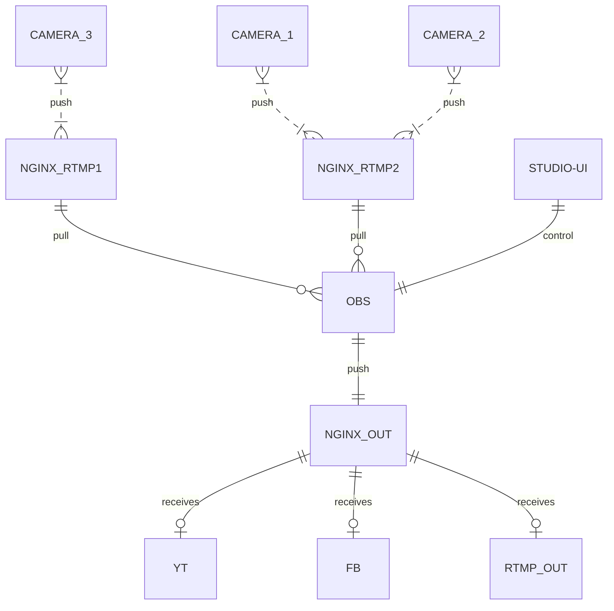

Make your
# Own studio
## for live streaming.
---
This repo aims to provide an easy setup to accept livestream input (like RTMP) from cameras, allow you to manipulate the video and stream it towards other platforms (another RTMP, yt, fb, twitch, etc.)

### Basic overview



### Usage

```shell
docker compose up -d
```

1. Navigate to http://localhost:5000/
2. Connect to the OBS Studio:

| | |
|---|---|
|URL|ws://localhost:4455|
|Password|abc123|

You can change the OBS Studio password in `global.ini` (or disable it) before starting containers.
